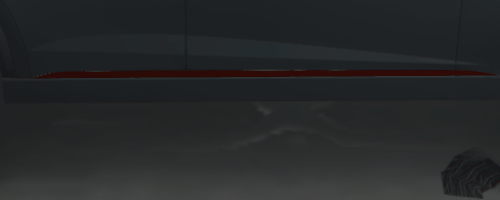

# A native progress bar for FiveM

A simple and complete native progress bar.

## Usage

To use the progress bar you just have to call the event `progress:bar:start` with the following parameters:

- ***time***: **integer**, time in miliseconds
- ***title*** (*optional*): **string**, bar title
- ***reverse*** (*optional*): **boolean**, bar inversion
- ***callback*** (*optional*): **string**, event triggered at end of time
- ***data*** (*optional*): **any**, data sent with callback event

## License

License under consideration...
